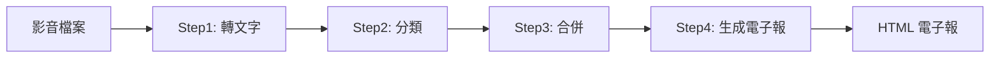

# 電子報文章生成系統 📰

一個功能完整的自動化電子報生成工具，能將影音內容轉換為專業的 HTML 電子報文章。


## ✨ 主要功能

- 🎥 **影音轉文字**: 使用 OpenAI Whisper 將影片/音訊檔案轉換為文字
- 🏷️ **智能分類**: 利用 Google Gemini AI 自動分類文本內容
- 📝 **內容合併**: 智能合併相關文本檔案
- 📧 **電子報生成**: 自動生成專業的 HTML 格式電子報
- 🎨 **模板自訂**: 支援自訂 HTML 模板和樣式
- 🖥️ **圖形介面**: 提供友善的 GUI 操作介面
- ⚙️ **設定管理**: 完整的設定儲存和載入功能

## 🚀 快速開始

### 系統需求

- Python 3.8 或更高版本
- FFmpeg (用於音視頻處理)
- Google Gemini API 金鑰

### 安裝步驟

1. **克隆專案**
   ```bash
   git clone https://github.com/nnimab/Media-to-newsletter-automation.git
   cd Media-to-newsletter-automation
   ```

2. **建立虛擬環境** (建議)
   ```bash
   python -m venv venv
   
   # Windows
   venv\Scripts\activate
   
   # macOS/Linux
   source venv/bin/activate
   ```

3. **安裝依賴**
   ```bash
   pip install -r requirements.txt
   ```

4. **安裝 FFmpeg**
   
   **Windows:**
   - 下載 [FFmpeg](https://ffmpeg.org/download.html#build-windows)
   - 解壓縮並將 bin 目錄加入系統 PATH
   
   **macOS:**
   ```bash
   brew install ffmpeg
   ```
   
   **Linux:**
   ```bash
   sudo apt update
   sudo apt install ffmpeg
   ```

5. **設定 API 金鑰**
   - 取得 [Google Gemini API 金鑰](https://makersuite.google.com/app/apikey)
   - 在應用程式中設定您的 API 金鑰

## 📖 使用方法

### GUI 介面 (推薦)

執行主程式啟動圖形介面：
```bash
python main_gui.py
```

### 命令列模式

依序執行各個步驟：
```bash
# Step 1: 影音轉文字
python Step1影音轉文字.py

# Step 2: 文本分類
python Step2分類.py

# Step 3: 合併文本
python Step3合併txt.py

# Step 4: 生成電子報
python Step4生成電子報.py
```

## 🔧 工作流程



1. **影音轉文字**: 將影片/音訊轉換為文字檔案
2. **文本分類**: AI 自動分類文本內容
3. **文本合併**: 合併相關主題的文本
4. **電子報生成**: 生成專業的 HTML 電子報

## 📁 專案結構

```
Media-to-newsletter-automation/
├── main_gui.py              # 主要 GUI 應用程式
├── Step1影音轉文字.py        # 影音轉文字模組
├── Step2分類.py             # 文本分類模組
├── Step3合併txt.py          # 文本合併模組
├── Step4生成電子報.py        # 電子報生成模組
├── Step5replace_video_section.py  # 影片區塊替換工具
├── step2_3_processor.py     # Step 2&3 處理器
├── 批量修改影片區塊.py       # 批量修改工具
├── rename_files.py          # 檔案重命名工具
├── requirements.txt         # Python 依賴清單
├── setup.bat               # Windows 安裝腳本
├── start.bat               # Windows 啟動腳本
└── README.md               # 專案說明文件
```

## ⚙️ 設定選項

應用程式提供豐富的自訂選項：

- **路徑設定**: 自訂輸入/輸出資料夾
- **API 設定**: Google Gemini API 金鑰和模型選擇
- **模板自訂**: 自訂電子報模板元素
- **內容控制**: 選擇是否包含影片連結
- **提示詞設定**: 自訂 AI 生成提示

## 🎨 模板自訂

支援自訂以下模板元素：
- Logo 圖片連結
- 研習會資訊
- 課程資訊
- 頁尾地址
- 影片嵌入設定

## 🤝 貢獻

歡迎提交 Issue 和 Pull Request！

1. Fork 專案
2. 建立功能分支 (`git checkout -b feature/AmazingFeature`)
3. 提交變更 (`git commit -m 'Add some AmazingFeature'`)
4. 推送到分支 (`git push origin feature/AmazingFeature`)
5. 開啟 Pull Request

## 📝 授權

本專案採用 MIT 授權條款 - 詳見 [LICENSE](LICENSE) 檔案

## 👨‍💻 作者

**Kris @NNimab**

- GitHub: [@nnimab](https://github.com/nnimab)

## 🙏 致謝

- [OpenAI Whisper](https://github.com/openai/whisper) - 語音識別
- [Google Gemini](https://ai.google.dev/) - AI 文本生成
- [CustomTkinter](https://github.com/TomSchimansky/CustomTkinter) - 現代化 GUI 框架

## 📞 支援

如果您遇到問題或有任何建議，請：
- 提交 [Issue](https://github.com/nnimab/Media-to-newsletter-automation/issues)
- 查看 [Wiki](https://github.com/nnimab/Media-to-newsletter-automation/wiki) (即將推出)

---

⭐ 如果這個專案對您有幫助，請給我們一個星星！ 